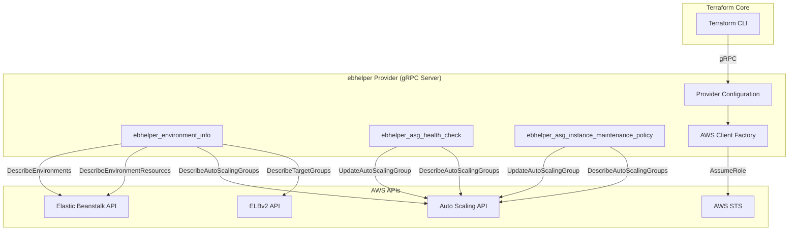
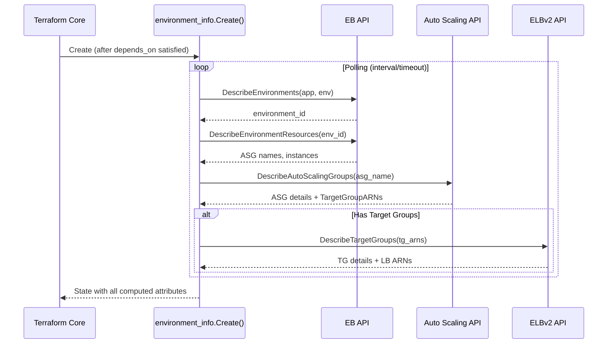
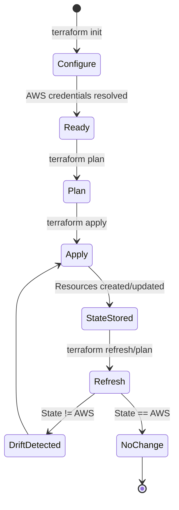
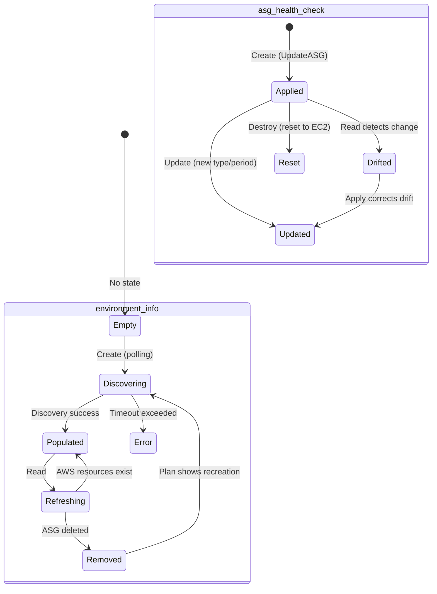

# Design Document: ebhelper Terraform Provider

## Overview

The `ebhelper` provider is a custom Terraform provider written in Go using the [Terraform Plugin Framework](https://developer.hashicorp.com/terraform/plugin/framework). It replaces fragile `null_resource` + `local-exec` shell scripts with proper managed resources that integrate into Terraform's state management, plan/apply lifecycle, and drift detection.

The provider serves two purposes:

1. **Deferred discovery** — `ebhelper_environment_info` discovers EB environment infrastructure (ASG, LB, TG) during the apply phase, solving the chicken-and-egg problem where data sources fail on first apply.
2. **ASG property patching** — Resources like `ebhelper_asg_health_check` and `ebhelper_asg_instance_maintenance_policy` modify individual properties on an EB-managed ASG via `UpdateAutoScalingGroup`, without taking ownership of the full ASG lifecycle.

### Design Decision: Why ebhelper for ASG properties?

AWS ASG settings fall into two categories:

| Category | Example | Native standalone resource? | Approach |
|----------|---------|---------------------------|----------|
| Standalone resources | Scheduled scaling, scaling policies, lifecycle hooks, notifications | ✅ Yes (`aws_autoscaling_schedule`, `aws_autoscaling_policy`, etc.) | Use native AWS provider with `ebhelper_environment_info.asg_name` |
| ASG-level properties | Health check type, maintenance policy, warm pool, cooldown, capacity rebalance | ❌ No (only settable on `aws_autoscaling_group` resource) | **Must use ebhelper** |

ASG-level properties cannot be managed natively because:
- `aws_autoscaling_group` is a full lifecycle resource — using it requires importing the EB-managed ASG
- Importing means Terraform takes ownership of ALL ASG attributes (min/max size, launch template, subnets, etc.)
- EB would fight Terraform on every deployment, causing constant drift and potential outages

The ebhelper provider acts as an **ASG property patcher**: it calls `UpdateAutoScalingGroup` for individual settings without claiming ownership of the full ASG. This is safe because:
- It only modifies the specific fields you configure
- EB doesn't manage these fields (health check type defaults to EC2, maintenance policy is unset)
- No conflict between EB and Terraform on deployments

### Future extensibility

All ASG-level properties follow the same implementation pattern:
1. Accept `asg_name` as input (from `ebhelper_environment_info`)
2. Call `UpdateAutoScalingGroup` with the specific field(s)
3. Read back via `DescribeAutoScalingGroups` for drift detection
4. Reset to default on destroy

If additional ASG properties are needed (warm pool, capacity rebalance, max instance lifetime, default cooldown), they can be added as new resources following this pattern.

The provider exposes three managed resources:

| Resource | Purpose |
|----------|---------|
| `ebhelper_environment_info` | Deferred data source — discovers EB environment infrastructure (ASG, LB, TG) during the apply phase with retry/polling |
| `ebhelper_asg_health_check` | Manages health check type and grace period on EB-managed ASGs |
| `ebhelper_asg_instance_maintenance_policy` | Manages instance maintenance policy on EB-managed ASGs |

**Key design decision**: `ebhelper_environment_info` is implemented as a *managed resource* (not a `data` source) because Terraform data sources execute during the plan phase. EB-created infrastructure (ASGs, target groups) does not exist until the EB environment resource completes its apply — creating a chicken-and-egg problem that only a managed resource with deferred execution can solve.

## API Discovery Chain (Validated)

Based on real API responses captured from a sandbox environment (see `testdata/`):

```
1. DescribeEnvironments(ApplicationName, EnvironmentNames)
   → EnvironmentId, EndpointURL, PlatformArn, HealthStatus, CNAME

2. DescribeEnvironmentResources(EnvironmentId)
   → AutoScalingGroups[].Name, Instances[].Id, LaunchTemplates[].Id, LoadBalancers[].Name

3. DescribeAutoScalingGroups(AutoScalingGroupNames)
   → AutoScalingGroupARN, TargetGroupARNs[], HealthCheckType, HealthCheckGracePeriod,
     InstanceMaintenancePolicy, LaunchTemplate, Instances[]

4. DescribeTargetGroups(TargetGroupArns)
   → TargetGroupName, LoadBalancerArns[] (authoritative LB association)

5. DescribeLoadBalancers(LoadBalancerArns)
   → DNSName, Scheme, CanonicalHostedZoneId
```

**Key findings from real environments:**
- Shared ALB envs have multiple TargetGroupARNs (multi-port routing)
- Multiple TGs can point to the same LB ARN → de-duplicate in `load_balancer_arns`
- `DescribeEnvironmentResources.LoadBalancers[].Name` is actually the LB ARN (misleading field name)
- `InstanceMaintenancePolicy` is only present when explicitly configured
- EB-created ALBs follow naming pattern `awseb--*`

**Test fixtures available at:** `.kiro/specs/eb-helper-provider/testdata/`
- `dedicated-alb/` — single TG, EB-owned ALB, no maintenance policy
- `shared-alb/` — multiple TGs, pre-existing ALB, maintenance policy set

## Architecture

### High-Level System Architecture



### Execution Flow — Environment Info Discovery



### Provider Lifecycle



## Components and Interfaces

### Go Package Structure

```
terraform-provider-ebhelper/
├── main.go                          # Entry point, provider server
├── go.mod
├── go.sum
├── internal/
│   ├── provider/
│   │   ├── provider.go              # Provider type, Configure, Schema
│   │   └── provider_test.go
│   ├── resources/
│   │   ├── environment_info/
│   │   │   ├── resource.go          # Resource type, CRUD methods
│   │   │   ├── model.go             # Terraform state model (types.String, etc.)
│   │   │   ├── discovery.go         # Polling/discovery orchestration
│   │   │   └── resource_test.go
│   │   ├── asg_health_check/
│   │   │   ├── resource.go          # Resource type, CRUD methods
│   │   │   ├── model.go             # Terraform state model
│   │   │   └── resource_test.go
│   │   └── asg_instance_maintenance_policy/
│   │       ├── resource.go          # Resource type, CRUD methods
│   │       ├── model.go             # Terraform state model
│   │       └── resource_test.go
│   └── awsclient/
│       ├── client.go                # AWS client factory with assume role
│       └── client_test.go
├── examples/
│   └── main.tf                      # Example usage
└── docs/                            # Generated documentation
```

### Provider Interface

```go
// internal/provider/provider.go

package provider

import (
    "context"

    "github.com/hashicorp/terraform-plugin-framework/datasource"
    "github.com/hashicorp/terraform-plugin-framework/provider"
    "github.com/hashicorp/terraform-plugin-framework/provider/schema"
    "github.com/hashicorp/terraform-plugin-framework/resource"
    "github.com/hashicorp/terraform-plugin-framework/types"
)

// EbhelperProvider implements the provider.Provider interface.
type EbhelperProvider struct {
    version string
}

// EbhelperProviderModel describes the provider config schema.
type EbhelperProviderModel struct {
    Region     types.String      `tfsdk:"region"`
    AssumeRole *AssumeRoleModel  `tfsdk:"assume_role"`
}

// AssumeRoleModel describes the assume_role block.
type AssumeRoleModel struct {
    RoleARN     types.String `tfsdk:"role_arn"`
    SessionName types.String `tfsdk:"session_name"`
    ExternalID  types.String `tfsdk:"external_id"`
}

func (p *EbhelperProvider) Metadata(_ context.Context, _ provider.MetadataRequest, resp *provider.MetadataResponse) {
    resp.TypeName = "ebhelper"
    resp.Version = p.version
}

func (p *EbhelperProvider) Schema(_ context.Context, _ provider.SchemaRequest, resp *provider.SchemaResponse) {
    resp.Schema = schema.Schema{...}
}

func (p *EbhelperProvider) Configure(ctx context.Context, req provider.ConfigureRequest, resp *provider.ConfigureResponse) {
    // 1. Parse provider config
    // 2. Build AWS config (default chain or assume role)
    // 3. Store AWS clients in provider data for resources to consume
}

func (p *EbhelperProvider) Resources(_ context.Context) []func() resource.Resource {
    return []func() resource.Resource{
        environment_info.NewResource,
        asg_health_check.NewResource,
        asg_instance_maintenance_policy.NewResource,
    }
}

func (p *EbhelperProvider) DataSources(_ context.Context) []func() datasource.DataSource {
    return nil // No data sources; environment_info is a managed resource
}
```

### AWS Client Factory

```go
// internal/awsclient/client.go

package awsclient

import (
    "context"
    "fmt"

    "github.com/aws/aws-sdk-go-v2/aws"
    "github.com/aws/aws-sdk-go-v2/config"
    "github.com/aws/aws-sdk-go-v2/credentials/stscreds"
    "github.com/aws/aws-sdk-go-v2/service/autoscaling"
    "github.com/aws/aws-sdk-go-v2/service/elasticbeanstalk"
    "github.com/aws/aws-sdk-go-v2/service/elasticloadbalancingv2"
    "github.com/aws/aws-sdk-go-v2/service/sts"
)

// Clients holds all AWS service clients needed by the provider.
type Clients struct {
    ElasticBeanstalk *elasticbeanstalk.Client
    AutoScaling      *autoscaling.Client
    ELBv2            *elasticloadbalancingv2.Client
}

// ELBClient abstracts ELBv2 API calls (both target groups and load balancers).
type ELBClient interface {
    DescribeTargetGroups(ctx context.Context, params *elasticloadbalancingv2.DescribeTargetGroupsInput, optFns ...func(*elasticloadbalancingv2.Options)) (*elasticloadbalancingv2.DescribeTargetGroupsOutput, error)
    DescribeLoadBalancers(ctx context.Context, params *elasticloadbalancingv2.DescribeLoadBalancersInput, optFns ...func(*elasticloadbalancingv2.Options)) (*elasticloadbalancingv2.DescribeLoadBalancersOutput, error)
}

// Config holds provider-level AWS configuration.
type Config struct {
    Region      string
    RoleARN     string
    SessionName string
    ExternalID  string
}

// NewClients builds AWS service clients from the provider config.
func NewClients(ctx context.Context, cfg Config) (*Clients, error) {
    // 1. Load default AWS config
    // 2. If RoleARN set, wrap with AssumeRole credential provider
    // 3. Construct service clients
    // 4. Return Clients or error with descriptive message
}
```

### Environment Info Resource

```go
// internal/resources/environment_info/resource.go

package environment_info

import (
    "context"

    "github.com/hashicorp/terraform-plugin-framework/resource"
    "github.com/hashicorp/terraform-plugin-framework/resource/schema"
)

type Resource struct {
    clients *awsclient.Clients
}

func NewResource() resource.Resource {
    return &Resource{}
}

func (r *Resource) Metadata(_ context.Context, req resource.MetadataRequest, resp *resource.MetadataResponse) {
    resp.TypeName = req.ProviderTypeName + "_environment_info"
}

func (r *Resource) Schema(_ context.Context, _ resource.SchemaRequest, resp *resource.SchemaResponse) {
    resp.Schema = schema.Schema{...} // See Data Models section
}

func (r *Resource) Configure(_ context.Context, req resource.ConfigureRequest, resp *resource.ConfigureResponse) {
    // Extract AWS clients from provider data
}

func (r *Resource) Create(ctx context.Context, req resource.CreateRequest, resp *resource.CreateResponse) {
    // 1. Read plan (application_name, environment_name, polling config)
    // 2. Run discovery with polling
    // 3. Populate all computed attributes
    // 4. Set state
}

func (r *Resource) Read(ctx context.Context, req resource.ReadRequest, resp *resource.ReadResponse) {
    // 1. Read current state
    // 2. Re-query AWS APIs for current values
    // 3. If ASG no longer exists, remove from state
    // 4. Update state with current values
}

func (r *Resource) Update(ctx context.Context, req resource.UpdateRequest, resp *resource.UpdateResponse) {
    // Only polling_interval/polling_timeout can change in-place
    // Re-run discovery with new settings
}

func (r *Resource) Delete(_ context.Context, _ resource.DeleteRequest, resp *resource.DeleteResponse) {
    // No-op: this resource doesn't create infrastructure
    // Just remove from state
}
```

```go
// internal/resources/environment_info/discovery.go

package environment_info

import (
    "context"
    "fmt"
    "time"

    "github.com/hashicorp/terraform-plugin-log/tflog"
)

// DiscoveryResult holds all data discovered from AWS APIs.
type DiscoveryResult struct {
    EnvironmentID    string
    EndpointURL      string
    PlatformARN      string
    HealthStatus     string
    ASGName          string
    ASGARN           string
    AllASGNames      []string
    TargetGroupARNs  []string
    TargetGroupNames []string
    LoadBalancerARNs []string
    LoadBalancerDNS  []string
    InstanceIDs      []string
    LaunchTemplateID string
}

// Discover runs the full discovery sequence with polling.
func Discover(ctx context.Context, clients *awsclient.Clients, appName, envName string, interval, timeout time.Duration) (*DiscoveryResult, error) {
    // 1. Poll DescribeEnvironments until environment found
    // 2. Call DescribeEnvironmentResources for ASG list
    // 3. Select first ASG from EB API as active
    // 4. Call DescribeAutoScalingGroups for full details
    // 5. If TargetGroupARNs present, call DescribeTargetGroups
    // 6. Resolve LB ARNs from target group metadata
    // Return DiscoveryResult or timeout error
}
```

### ASG Health Check Resource

```go
// internal/resources/asg_health_check/resource.go

package asg_health_check

type Resource struct {
    clients *awsclient.Clients
}

func (r *Resource) Create(ctx context.Context, req resource.CreateRequest, resp *resource.CreateResponse) {
    // 1. Read plan (asg_name, health_check_type, health_check_grace_period)
    // 2. Call UpdateAutoScalingGroup with HealthCheckType + HealthCheckGracePeriod
    // 3. Set resource ID = asg_name
    // 4. Set state
}

func (r *Resource) Read(ctx context.Context, req resource.ReadRequest, resp *resource.ReadResponse) {
    // 1. Call DescribeAutoScalingGroups
    // 2. Compare current values with state for drift detection
    // 3. Update state with current values
}

func (r *Resource) Update(ctx context.Context, req resource.UpdateRequest, resp *resource.UpdateResponse) {
    // 1. Call UpdateAutoScalingGroup with new values
    // 2. Update state
}

func (r *Resource) Delete(ctx context.Context, req resource.DeleteRequest, resp *resource.DeleteResponse) {
    // Reset to EC2 health check with 300s grace period
}
```

### ASG Instance Maintenance Policy Resource

```go
// internal/resources/asg_instance_maintenance_policy/resource.go

package asg_instance_maintenance_policy

type Resource struct {
    clients *awsclient.Clients
}

func (r *Resource) Create(ctx context.Context, req resource.CreateRequest, resp *resource.CreateResponse) {
    // 1. Read plan (asg_name, min_healthy_percentage, max_healthy_percentage)
    // 2. Validate ranges (0-100 for min, 100-200 for max)
    // 3. Call UpdateAutoScalingGroup with InstanceMaintenancePolicy
    // 4. Set resource ID = asg_name
    // 5. Set state
}

func (r *Resource) Read(ctx context.Context, req resource.ReadRequest, resp *resource.ReadResponse) {
    // 1. Call DescribeAutoScalingGroups
    // 2. Read InstanceMaintenancePolicy from response
    // 3. Update state with current values
}

func (r *Resource) Update(ctx context.Context, req resource.UpdateRequest, resp *resource.UpdateResponse) {
    // 1. Call UpdateAutoScalingGroup with new policy values
    // 2. Update state
}

func (r *Resource) Delete(ctx context.Context, req resource.DeleteRequest, resp *resource.DeleteResponse) {
    // Remove policy: set MinHealthyPercentage=-1, MaxHealthyPercentage=-1
}
```

### Interface Definitions

```go
// AWS service interfaces for testability (mock injection)

// EBClient abstracts Elastic Beanstalk API calls.
type EBClient interface {
    DescribeEnvironments(ctx context.Context, params *elasticbeanstalk.DescribeEnvironmentsInput, optFns ...func(*elasticbeanstalk.Options)) (*elasticbeanstalk.DescribeEnvironmentsOutput, error)
    DescribeEnvironmentResources(ctx context.Context, params *elasticbeanstalk.DescribeEnvironmentResourcesInput, optFns ...func(*elasticbeanstalk.Options)) (*elasticbeanstalk.DescribeEnvironmentResourcesOutput, error)
}

// ASGClient abstracts Auto Scaling API calls.
type ASGClient interface {
    DescribeAutoScalingGroups(ctx context.Context, params *autoscaling.DescribeAutoScalingGroupsInput, optFns ...func(*autoscaling.Options)) (*autoscaling.DescribeAutoScalingGroupsOutput, error)
    UpdateAutoScalingGroup(ctx context.Context, params *autoscaling.UpdateAutoScalingGroupInput, optFns ...func(*autoscaling.Options)) (*autoscaling.UpdateAutoScalingGroupOutput, error)
}

// ELBClient abstracts ELBv2 API calls.
type ELBClient interface {
    DescribeTargetGroups(ctx context.Context, params *elasticloadbalancingv2.DescribeTargetGroupsInput, optFns ...func(*elasticloadbalancingv2.Options)) (*elasticloadbalancingv2.DescribeTargetGroupsOutput, error)
    DescribeLoadBalancers(ctx context.Context, params *elasticloadbalancingv2.DescribeLoadBalancersInput, optFns ...func(*elasticloadbalancingv2.Options)) (*elasticloadbalancingv2.DescribeLoadBalancersOutput, error)
}
```

## Data Models

### Provider Configuration Schema

```hcl
provider "ebhelper" {
  region = "ap-southeast-2"   # Optional, uses AWS default chain

  assume_role {                # Optional block
    role_arn     = "arn:aws:iam::123456789012:role/CrossAccountRole"
    session_name = "terraform-ebhelper"    # Optional
    external_id  = "my-external-id"       # Optional
  }
}
```

### Environment Info Resource Model

```go
// internal/resources/environment_info/model.go

type EnvironmentInfoModel struct {
    // Inputs (Required)
    ApplicationName types.String `tfsdk:"application_name"`
    EnvironmentName types.String `tfsdk:"environment_name"`

    // Inputs (Optional with defaults)
    PollingInterval types.Int64 `tfsdk:"polling_interval"`  // seconds, default 10
    PollingTimeout  types.Int64 `tfsdk:"polling_timeout"`   // seconds, default 300

    // Computed - Identity
    ID types.String `tfsdk:"id"` // environment_id

    // Computed - EB Metadata
    EnvironmentID types.String `tfsdk:"environment_id"`
    EndpointURL   types.String `tfsdk:"endpoint_url"`
    PlatformARN   types.String `tfsdk:"platform_arn"`
    HealthStatus  types.String `tfsdk:"health_status"`

    // Computed - ASG
    ASGName     types.String `tfsdk:"asg_name"`
    ASGARN      types.String `tfsdk:"asg_arn"`
    AllASGNames types.List   `tfsdk:"all_asg_names"` // []string

    // Computed - Load Balancer
    LoadBalancerARNs types.List `tfsdk:"load_balancer_arns"`      // []string
    LoadBalancerDNS  types.List `tfsdk:"load_balancer_dns_names"` // []string

    // Computed - Target Groups
    TargetGroupARNs  types.List `tfsdk:"target_group_arns"`  // []string
    TargetGroupNames types.List `tfsdk:"target_group_names"` // []string

    // Computed - Instances
    InstanceIDs      types.List   `tfsdk:"instance_ids"`       // []string
    LaunchTemplateID types.String `tfsdk:"launch_template_id"`
}
```

**Schema behavior**:
- `application_name`: Required, ForceNew (triggers replacement on change)
- `environment_name`: Required, ForceNew (triggers replacement on change)
- `polling_interval`: Optional, Default=10, in-place update
- `polling_timeout`: Optional, Default=300, in-place update
- All other attributes: Computed (read-only, set during apply)

### ASG Health Check Resource Model

```go
// internal/resources/asg_health_check/model.go

type ASGHealthCheckModel struct {
    ID                   types.String `tfsdk:"id"`       // = asg_name
    ASGName              types.String `tfsdk:"asg_name"` // Required
    HealthCheckType      types.String `tfsdk:"health_check_type"`         // Required: "EC2" | "ELB"
    HealthCheckGracePeriod types.Int64  `tfsdk:"health_check_grace_period"` // Optional, default 300
}
```

**Schema behavior**:
- `asg_name`: Required, ForceNew (different ASG = different resource)
- `health_check_type`: Required, in-place update
- `health_check_grace_period`: Optional, Default=300, in-place update

### ASG Instance Maintenance Policy Model

```go
// internal/resources/asg_instance_maintenance_policy/model.go

type ASGMaintenancePolicyModel struct {
    ID                   types.String `tfsdk:"id"`       // = asg_name
    ASGName              types.String `tfsdk:"asg_name"` // Required
    MinHealthyPercentage types.Int64  `tfsdk:"min_healthy_percentage"` // Required: 0-100
    MaxHealthyPercentage types.Int64  `tfsdk:"max_healthy_percentage"` // Required: 100-200
}
```

**Schema behavior**:
- `asg_name`: Required, ForceNew
- `min_healthy_percentage`: Required, in-place update, validator: 0 ≤ value ≤ 100
- `max_healthy_percentage`: Required, in-place update, validator: 100 ≤ value ≤ 200

### Terraform State Transitions



## Correctness Properties

*A property is a characteristic or behavior that should hold true across all valid executions of a system — essentially, a formal statement about what the system should do. Properties serve as the bridge between human-readable specifications and machine-verifiable correctness guarantees.*

### Property 1: Error messages include contextual identifiers

*For any* error produced by the provider (STS failure, environment not found, ASG not found, polling timeout), the error message SHALL contain all relevant input identifiers (role ARN for STS errors, application name + environment name for discovery errors, ASG name for ASG-not-found errors, timeout duration for timeout errors) so that operators can identify which resource and configuration caused the failure.

**Validates: Requirements 1.5, 2.7, 3.5, 4.4, 8.8, 9.8**

### Property 2: Active ASG selection is deterministic from EB API

*For any* non-empty list of ASG names returned by the Elastic Beanstalk DescribeEnvironmentResources API, the provider SHALL always select the first ASG in the list as the Active_ASG, regardless of the number of ASGs present or their creation timestamps.

**Validates: Requirements 3.2**

### Property 3: Discovery result to state model mapping is lossless

*For any* valid DiscoveryResult (containing environment metadata, ASG details, target group details, and load balancer details), mapping it to the EnvironmentInfoModel SHALL preserve every non-nil value in its corresponding state attribute. Fields that are nil or empty in the DiscoveryResult SHALL map to empty strings for scalar attributes and empty lists for collection attributes (never null/unknown).

**Validates: Requirements 5.1, 5.2, 5.3, 5.4, 5.5, 5.7**

### Property 4: Polling respects timeout bounds

*For any* polling configuration with interval `I` and timeout `T` where `T > 0` and `I > 0`, when the discovery target is never available, the polling mechanism SHALL terminate within `T + I` seconds (one interval grace) and the number of retry attempts SHALL be at most `⌈T/I⌉ + 1`.

**Validates: Requirements 4.3**

### Property 5: Health check type enum validation

*For any* string value provided as `health_check_type`, the validator SHALL accept the value if and only if it equals "EC2" or "ELB" (case-sensitive). All other strings SHALL produce a validation error before any API call is made.

**Validates: Requirements 8.2**

### Property 6: Maintenance policy percentage range validation

*For any* integer value provided as `min_healthy_percentage`, the validator SHALL accept the value if and only if `0 ≤ value ≤ 100`. *For any* integer value provided as `max_healthy_percentage`, the validator SHALL accept the value if and only if `100 ≤ value ≤ 200`. Values outside these ranges SHALL produce a validation error before any API call is made.

**Validates: Requirements 9.2, 9.3, 9.9, 9.10**


## Error Handling

### Error Categories

| Category | Source | Handling Strategy |
|----------|--------|-------------------|
| Configuration Errors | Invalid provider config (bad region, malformed ARN) | Return during `Configure()` — provider unusable |
| Authentication Errors | STS AssumeRole failure | Return descriptive error with role ARN + underlying message |
| Validation Errors | Invalid attribute values (bad percentage, bad enum) | Schema validators reject at plan time, before any API call |
| Discovery Timeout | EB resources not yet available | Polling loop with configurable timeout; descriptive timeout error |
| Resource Not Found | ASG deleted externally | Read returns empty state (triggers recreation in next plan) |
| AWS API Errors | Throttling, permissions, service outage | Propagate with context (which API, which resource, original error) |

### Error Message Format

All errors follow a consistent format:
```
[resource_type] operation failed: <contextual details>. <underlying error>
```

Examples:
- `[ebhelper_environment_info] discovery timeout after 300s: environment "my-app/my-env" not found`
- `[ebhelper_asg_health_check] create failed: ASG "awseb-xxx" not found`
- `[ebhelper provider] assume role failed for "arn:aws:iam::123:role/X": AccessDenied`

### Retry vs. Fail-Fast

| Scenario | Behavior |
|----------|----------|
| Environment not yet created | Retry (polling loop) |
| ASG not yet provisioned by EB | Retry (polling loop) |
| Invalid credentials / permissions | Fail fast (no retry) |
| ASG explicitly deleted | Fail fast (remove from state) |
| Throttling (429) | Rely on AWS SDK built-in retry |
| Validation error | Fail fast at plan time |

### Terraform Diagnostics

The provider uses `resp.Diagnostics` from the Plugin Framework to report errors:
- **Error diagnostics** halt execution for the resource
- **Warning diagnostics** allow execution to continue (used for multi-ASG advisory)
- All diagnostic messages include the `Summary` (short) and `Detail` (full context) fields

## Testing Strategy

### Testing Pyramid

```
┌──────────────────────────────┐
│    Acceptance Tests (few)    │  Full Terraform lifecycle with mocked AWS
├──────────────────────────────┤
│   Integration Tests (some)   │  Provider Configure + resource CRUD with mocked AWS clients
├──────────────────────────────┤
│  Property Tests (targeted)   │  Validators, mapping logic, polling bounds, error formatting
├──────────────────────────────┤
│    Unit Tests (many)         │  Individual functions, schema checks, model conversions
└──────────────────────────────┘
```

### Property-Based Testing

**Library**: [rapid](https://github.com/flyingmutant/rapid) — a Go property-based testing library (fast-check style, with integrated shrinking)

**Configuration**: Minimum 100 iterations per property test.

**Property tests to implement:**

| Property | Test File | What Varies |
|----------|-----------|-------------|
| P1: Error context | `internal/resources/*_test.go` | Random identifiers (ARNs, names, durations) |
| P2: ASG selection | `internal/resources/environment_info/discovery_test.go` | Random ASG name lists (1-10 items) |
| P3: Model mapping | `internal/resources/environment_info/model_test.go` | Random DiscoveryResult structs |
| P4: Polling bounds | `internal/resources/environment_info/discovery_test.go` | Random interval/timeout pairs |
| P5: Enum validation | `internal/resources/asg_health_check/resource_test.go` | Random strings |
| P6: Range validation | `internal/resources/asg_instance_maintenance_policy/resource_test.go` | Random integers |

Each property test is tagged with:
```go
// Feature: eb-helper-provider, Property 1: Error messages include contextual identifiers
```

### Unit Tests

- Schema correctness (all attributes present, types correct, Required/Optional/Computed flags)
- Default values applied correctly
- ForceNew plan modifiers on identity attributes
- Destroy behavior (reset to defaults)

### Integration Tests (Mocked AWS)

Using interface-based mocks for `EBClient`, `ASGClient`, `ELBClient`:
- Full Create → Read → Update → Delete lifecycle
- Drift detection (Read returns different values than state)
- Polling with simulated delays
- Error propagation from AWS SDK

### Acceptance Tests

Using `resource.Test()` from the Terraform Plugin Testing framework:
- Provider configuration with assume_role
- Resource creation with `depends_on` ordering
- Import testing (where applicable)
- Full plan/apply/destroy cycle

### Test Dependencies

```go
// go.mod test dependencies
require (
    github.com/hashicorp/terraform-plugin-testing v1.x
    github.com/flyingmutant/rapid v1.x
    github.com/stretchr/testify v1.x
)
```

### CI Pipeline

1. `go vet ./...` — static analysis
2. `go test ./... -count=1` — all unit + property tests
3. `TF_ACC=1 go test ./... -run TestAcc` — acceptance tests (requires AWS creds or LocalStack)
